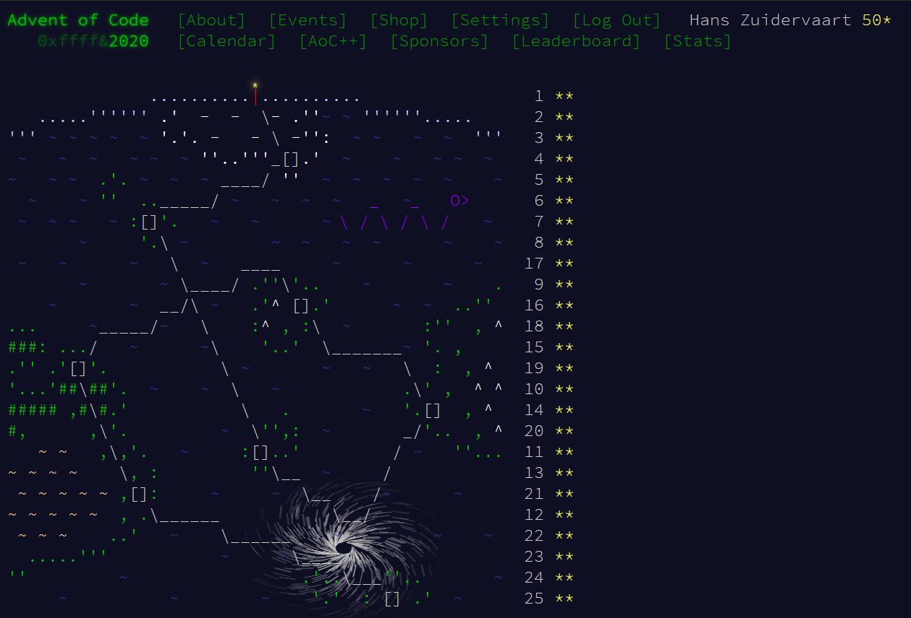

## Advent of code 2020

---

Project by Hans Zuidervaart, december 2020

This is a project to participate in [AdventOfCode 2020](https://adventofcode.com/2020)

---

## Intro

After saving Christmas five years in a row,
you've decided to take a vacation at a nice resort on a tropical island.
Surely, Christmas will go on without you.

The tropical island has its own currency and is entirely cash-only.
The gold coins used there have a little picture of a starfish; the locals just call them stars.
None of the currency exchanges seem to have heard of them, but somehow,
you'll need to find fifty of these coins by the time you arrive so you can pay the deposit on your room.

To save your vacation, you need to get all fifty stars by December 25th.

Collect stars by solving puzzles.
Two puzzles will be made available on each day in the Advent calendar;
the second puzzle is unlocked when you complete the first. Each puzzle grants one star. Good luck!

---

## Completed

You spend all fifty stars to cover the room deposit!

As you fix the soft serve machine, Santa offers you a ride in his sleigh; maybe the resort has a chimney you can use...

Congratulations! You've finished every puzzle in Advent of Code 2020! I hope you had as much fun solving them as I had
making them for you. I'd love to hear about your adventure; you can get in touch with me via contact info on my website
or through Twitter.

If you'd like to see more things like this in the future, please consider supporting Advent of Code and sharing it with
others.

To hear about future projects, you can follow me on Twitter.

I've highlighted the easter eggs in each puzzle, just in case you missed any. Hover your mouse over them, and the easter
egg will appear.

You can [Shareon Twitter Mastodon] this moment with your friends, or [Go Check on Your Calendar].

---

## Credits

Credits to [Johan de Jong](https://github.com/johandj123)
and [TheTurkeyDev](https://github.com/TheTurkeyDev/Advent-of-Code-2020)

---

## Sources

- [Ascii art Advent of code 2020!](http://patorjk.com/software/taag/#p=display&f=Epic&t=Advent%20of%20code%202020!)
- [Chinese remainder theorem](https://math.stackexchange.com/questions/3088578/find-the-smallest-natural-number-using-chinese-remainder-theorem)

---

