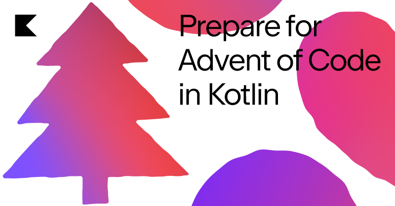

# Advent of code 2022

---

## Introduction

This is a project to participate in [AdventOfCode 2022](https://adventofcode.com/2022)

Advent of Code is an Advent calendar of small programming puzzles for a variety of skill sets and skill levels that can
be solved in any programming language you like. People use them as a speed contest, interview prep, company training,
university coursework, practice problems, or to challenge each other.



---

## Prerequisites

It is advised to use a recent version of Intellij IDEA to get the best support for the most recent version of Kotlin.

---

## Running tests

Via maven: `mvn clean test`
Also possible via the ide of your choice

---

## Running the main method

The Main method is located [here](src/main/kotlin/aoc/Launcher.kt). You can use this to run all puzzles at ones

---

## Making an executable jar

run `mvn clean package` to generate the jar with dependencies.

After generating the jar you can run the following commands to execute it:

```shell
cd target
java -jar advent-of-code-2022-1.0-SNAPSHOT-jar-with-dependencies.jar ../input
pause
```

---

## Troubleshooting

- [Kotlin + Java 9 modules: Module java.base cannot be found in the module graph](https://www.appsloveworld.com/kotlin/100/7/kotlin-java-9-modules-module-java-base-cannot-be-found-in-the-module-graph)
- [Markdown shell scripts run in reverse order](https://youtrack.jetbrains.com/issue/IDEA-294997/Markdown-shell-scripts-run-in-reverse-order)

---

## Sources

- [Advent of code 2022!](http://patorjk.com/software/taag/#p=display&f=Cursive&t=Advent%20of%20code%202022!)
- [Kotlin docs](https://kotlinlang.org/docs/home.html)
- [Powered by Kotlin and Java Banner](http://patorjk.com/software/taag/#p=display&f=Cursive&t=Powered%20by%20Kotlin%20and%20Java)

---
